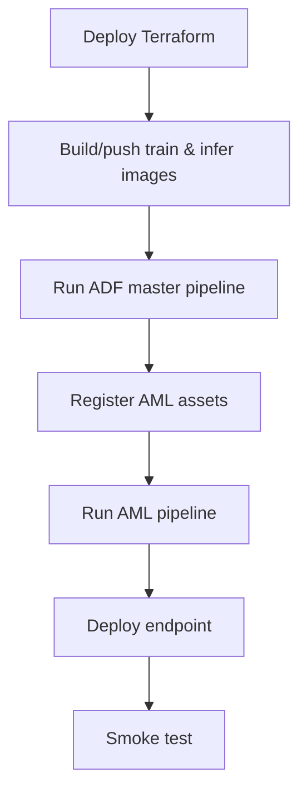

# Azure MLOps Cancer Diagnosis (IaC)

Terraform-first Azure MLOps infrastructure with a modular folder layout. We will add resources one at a time; the first module provisions the resource group.

## Dataset
This project uses the UCI Breast Cancer dataset stored locally under `data/`.

Source: `https://archive.ics.uci.edu/dataset/14/breast+cancer`

Attribution (required):
Zwitter, M. & Soklic, M. (1988). Breast Cancer [Dataset]. UCI Machine Learning Repository. https://doi.org/10.24432/C51P4M.

## Architecture Overview

```mermaid
flowchart LR
    SRC[GitHub raw CSV] -->|ADF Copy| BR["(ADLS bronze)"]
    BR -->|ADF Data Flow| SI["(ADLS silver Parquet)"]
    SI -->|ADF Data Flow| GO["(ADLS gold features)"]
    GO -->|AML Pipeline| TR[Train]
    TR --> EV[Evaluate]
    EV --> REG[Register Model]
    REG --> EP[Managed Online Endpoint]
    EP --> INFER[Inference / API]
```

<span style="color:#1E88E5"><b>Data flow</b></span>


<span style="color:#1E88E5"><b>Run order</b></span>


## Quick Start
1) Install prerequisites:
   - Azure CLI (az)
   - Terraform (>= 1.5)
   - Python 3.10+

2) Authenticate to Azure:
```powershell
az login
az account show
```

3) Deploy infrastructure:
```powershell
uv run .\scripts\deploy.py
```
The deploy script now **automatically triggers the ADF master pipeline** (HTTP -> bronze -> silver -> gold) after provisioning ADF. Use `--skip-adf-run` to opt out.

## GitHub Actions (CI/CD)
Set the service principal secret so workflows can authenticate to Azure:

1) Create service principal JSON:
```powershell
az ad sp create-for-rbac --name "gh-mlops-cancer" --role contributor --scopes /subscriptions/<subscription-id> --sdk-auth
```

2) In GitHub: **Settings -> Secrets and variables -> Actions -> New repository secret**
   - Name: `AZURE_CREDENTIALS`
   - Value: paste the **entire JSON** output from the command above.

3) Grant the service principal RBAC assignment rights (one-time):
```powershell
az role assignment create --assignee <clientId> --role "User Access Administrator" --scope /subscriptions/<subscription-id>
```
Note: this command does **not** change `AZURE_CREDENTIALS`. You do not need to update the GitHub secret after granting this role.

4) Remote state (required for GitHub Actions deploy/destroy):
   - Add secrets:
     - `BACKEND_RESOURCE_GROUP_NAME` (e.g., `rg-mlops-cancer-tfstate`)
     - `BACKEND_STORAGE_ACCOUNT_NAME` (must be globally unique, lower-case, 3-24 chars)
     - Optional: `BACKEND_CONTAINER_NAME` (default `tfstate`)

Workflows:
- `.github/workflows/ci.yml`
- `.github/workflows/deploy_dev.yml`
- `.github/workflows/deploy_prod.yml`
- `.github/workflows/destroy.yml` (manual with confirm)

## Resource Naming
Resource names use a clear prefix plus a random animal suffix for uniqueness, for example:
`rg-mlops-cancer-bright-otter`

Override by setting explicit name variables or adjusting the prefixes in `.env` or the scripts.

## Project Structure
- `terraform/00_backend`: Remote Terraform state (storage account + container)
- `terraform/01_resource_group`: Azure resource group
- `terraform/02_networking`: VNet + subnets (foundation for private endpoints)
- `terraform/03_storage_account`: ADLS Gen2 storage account + containers
- `terraform/04_key_vault`: Azure Key Vault
- `terraform/05_log_analytics_app_insights`: Log Analytics + Application Insights
- `terraform/06_container_registry`: Azure Container Registry (ACR)
- `terraform/07_data_factory`: Azure Data Factory (system-assigned identity)
- `terraform/08_adf_linked_services`: ADF linked services (HTTP + ADLS Gen2)
- `terraform/09_adf_pipeline_http`: ADF pipeline to land raw dataset into ADLS bronze
- `terraform/10_adf_dataflow_bronze_silver`: ADF mapping data flow for bronze -> silver cleanup
- `terraform/11_adf_pipeline_silver_dataflow`: ADF pipeline to execute bronze -> silver data flow
- `terraform/12_adf_dataflow_silver_gold`: ADF mapping data flow for silver -> gold feature encoding
- `terraform/13_adf_pipeline_gold_dataflow`: ADF pipeline to execute silver -> gold data flow
- `terraform/14_adf_pipeline_master`: ADF master pipeline (ingest -> silver -> gold)
- `terraform/15_machine_learning_workspace`: Azure ML workspace (v2)
- `terraform/16_aml_storage_account`: Non-HNS storage account for AML workspace
- `terraform/17_aml_compute`: AML compute cluster
- `terraform/18_acr_rbac`: AcrPull for AML compute identity
- `terraform/19_storage_rbac`: Storage Blob Data Contributor for AML compute identity
- `docker/train`: Training image Dockerfile + requirements
- `docker/inference`: Inference image Dockerfile + requirements
- `src/training`: Training/evaluation/register scripts
- `src/inference`: Online scoring script
- `pipelines/aml/jobs`: Azure ML job YAMLs
- `pipelines/aml/pipeline.yml`: AML pipeline template (rendered for portal run)
- `scripts/register_aml_assets.py`: Registers AML environment + renders pipeline YAML
- `scripts/run_pipeline_component.py`: Submits the AML pipeline component
- `scripts/deploy_endpoint.py`: Deploys managed online endpoint
- `scripts/smoke_test_endpoint.py`: Smoke test for the online endpoint
- `scripts/preflight.ps1`: Prints workspace/compute/ACR identities
- `scripts/`: Deploy/destroy helpers (auto-writes terraform.tfvars)
- `guides/setup.md`: Detailed setup guide

## Deploy/Destroy Options
Deploy:
```powershell
python scripts\deploy.py
python scripts\deploy.py --rg-only
python scripts\deploy.py --networking-only
python scripts\deploy.py --storage-only
python scripts\deploy.py --keyvault-only
python scripts\deploy.py --observability-only
python scripts\deploy.py --acr-only
python scripts\deploy.py --datafactory-only
python scripts\deploy.py --adf-links-only
python scripts\deploy.py --adf-pipeline-only
python scripts\deploy.py --adf-dataflow-only
python scripts\deploy.py --adf-silver-pipeline-only
python scripts\deploy.py --adf-gold-dataflow-only
python scripts\deploy.py --adf-gold-pipeline-only
python scripts\deploy.py --adf-master-pipeline-only
python scripts\deploy.py --aml-only
python scripts\deploy.py --aml-storage-only
python scripts\deploy.py --aml-job-config-only
python scripts\deploy.py --acr-build-train-image
python scripts\deploy.py --docker-build-train-image
python scripts\deploy.py --docker-build-infer-image
python scripts\deploy.py --aml-compute-only
python scripts\deploy.py --acr-rbac-only
python scripts\deploy.py --storage-rbac-only
python scripts\deploy.py --skip-adf-run
```

Destroy:
```powershell
python scripts\destroy.py
python scripts\destroy.py --destroy-backend
python scripts\destroy.py --rg-only
python scripts\destroy.py --networking-only
python scripts\destroy.py --storage-only
python scripts\destroy.py --keyvault-only
python scripts\destroy.py --observability-only
python scripts\destroy.py --acr-only
python scripts\destroy.py --datafactory-only
python scripts\destroy.py --adf-links-only
python scripts\destroy.py --adf-pipeline-only
python scripts\destroy.py --adf-dataflow-only
python scripts\destroy.py --adf-silver-pipeline-only
python scripts\destroy.py --adf-gold-dataflow-only
python scripts\destroy.py --adf-gold-pipeline-only
python scripts\destroy.py --adf-master-pipeline-only
python scripts\destroy.py --aml-only
python scripts\destroy.py --aml-storage-only
python scripts\destroy.py --aml-compute-only
python scripts\destroy.py --acr-rbac-only
python scripts\destroy.py --storage-rbac-only
```

## Outputs
After each apply, module outputs are written to the module folder, for example:
- `terraform/00_backend/outputs.json`
- `terraform/01_resource_group/outputs.json`
- `terraform/02_networking/outputs.json`
- `terraform/03_storage_account/outputs.json`
- `terraform/04_key_vault/outputs.json`
- `terraform/05_log_analytics_app_insights/outputs.json`
- `terraform/06_container_registry/outputs.json`
- `terraform/07_data_factory/outputs.json`
- `terraform/08_adf_linked_services/outputs.json`
- `terraform/09_adf_pipeline_http/outputs.json`
- `terraform/10_adf_dataflow_bronze_silver/outputs.json`
- `terraform/11_adf_pipeline_silver_dataflow/outputs.json`
- `terraform/12_adf_dataflow_silver_gold/outputs.json`
- `terraform/13_adf_pipeline_gold_dataflow/outputs.json`
- `terraform/14_adf_pipeline_master/outputs.json`
- `terraform/15_machine_learning_workspace/outputs.json`
- `terraform/16_aml_storage_account/outputs.json`
- `terraform/17_aml_compute/outputs.json`
- `terraform/18_acr_rbac/outputs.json`
- `terraform/19_storage_rbac/outputs.json`

## Azure ML (local build + job)
Build and push a training image:
```powershell
az acr login --name <acr-name>
docker build -t <acr-login-server>/mlops-cancer-train:0.1.0 -f docker/train/Dockerfile .
docker push <acr-login-server>/mlops-cancer-train:0.1.0
```

Build in ACR (no local Docker required):
```powershell
python scripts\deploy.py --acr-build-train-image
```

Register AML environment and render the pipeline YAML:
```powershell
uv run .\scripts\register_aml_assets.py
```

Register the pipeline component and submit a run:
```powershell
uv run .\scripts\register_aml_assets.py --register-pipeline-component --pipeline-component-version 1
uv run .\scripts\run_pipeline_component.py --register-data-asset --component-version 1
```

Deploy endpoint and smoke test:
```powershell
uv run .\scripts\deploy.py --docker-build-infer-image
uv run .\scripts\deploy_endpoint.py
uv run .\scripts\smoke_test_endpoint.py --endpoint-name <endpoint-name>
```

Submit a legacy single-job run:
```powershell
az ml job create --file pipelines/aml/jobs/train.yml --resource-group <rg> --workspace-name <aml-workspace>
```
